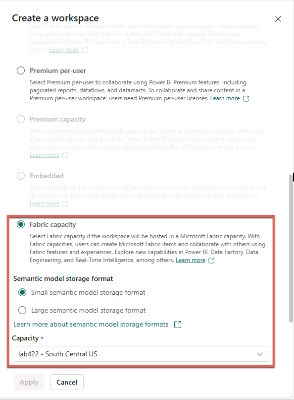
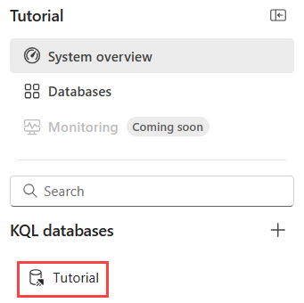
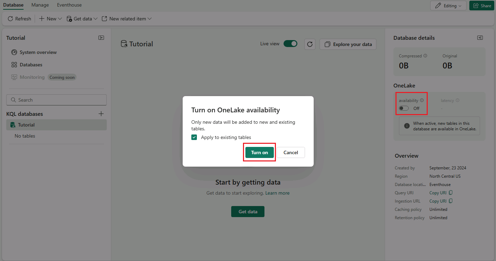

# Real-Time Intelligence tutorial part 1: Create resources

In this part of the tutorial, you set up the environment. Specifically, you create a *workspace* and an *eventhouse*, which automatically creates a child KQL database, and then you enable OneLake availability.

## Create a workspace
1. Sign in to the [Microsoft Fabric portal](https://fabric.microsoft.com).
2. Choose **Real-Time Intelligence** from the list of options on the home page or the menu bar on the bottom left of the portal.

    

3. Select **Workspaces** from the left navigation pane. Then select **+ New workspace**.
4. Enter a name for the workspace, such as +++*TutorialWorkspace_@lab.LabInstance.Id*+++. Expand the **Advanced** option and make sure **Trial** is selected then select **Apply** when done.

    

## Create an eventhouse

1. Browse to the workspace that you just created in the previous step. It will be located in the left hand navigation pane under Workspaces.
2. Ensure that there is a diamond icon next to the workspace name, which indicates that the workspace is associated with a Fabric Capacity *(in this case the free trial)*.

    

    If the diamond icon is not present, select **Workspace Settings** >  **License Info**. On the License Configuration tile, Select the **Edit**, under License Mode select **Trial**  and finally select *Select License*.

3. On the bottom left experience switcher, select **Real-Time Intelligence**.

4. In upper right corner under recommended items to create select **Eventhouse**.

    

5. Enter +++*Tutorial*+++ as the eventhouse name. A KQL database will be created simultaneously with the same name.

6. Select **Create**. When provisioning is complete, Select **Get started** and the eventhouse **System overview** page is shown.

## Turn on OneLake availability

1. From the **System overview** page, select the KQL database which was created in the previous step.

    

2. In the **Database details** section, toggle OneLake Availability to **On**. In the confirmation dialog ensure **Apply to existing tables is checked**  and select **Turn on**.

    

## Next step

> Select **Next >** in these instructions to go to the next part of the tutorial: Get data in the Real-Time hub.