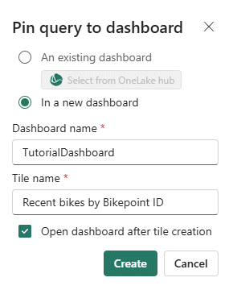

# Real-Time Intelligence tutorial part 4: Create a Real-Time dashboard

In this part of the tutorial, learn how to create a Real-Time dashboard in Real-Time Intelligence. You create a KQL query, create a Real-Time dashboard, add a new tile to the dashboard, and explore the data visually by adding an aggregation.

## Create a Real-Time dashboard

1. In your KQL queryset, copy/paste, and run the following query. This query returns a column chart showing the most recent number of bikes by *BikepoointID*.

    ```kusto
    TutorialTable
    | summarize arg_max(Timestamp, No_Bikes) by BikepointID
    | sort by BikepointID
    | render columnchart with (ycolumns=No_Bikes, xcolumn= BikepointID)
    ```

    

2. Select **Pin to dashboard**. 
3. Enter the following information:

    

    | Field | Value |
    | --- | --- |
    | **Create new tile** | *In a new dashboard* |
    | **Dashboard name** | *TutorialDashboard* |
    | **Tile name** | *Recent bikes by Bikepoint* |
    | **Open dashboard after creation** | *Selected* |

4. Select **Create**.

The new dashboard, *TutorialDashboard*, opens with the *Recent bikes by Bikepoint* tile.

## Add a new tile to the dashboard

1. On the top menu bar, toggle from **Viewing** mode to **Editing** mode.
2. Select **New tile**

    

3. In the query editor enter the following query:

    ```kusto
    TutorialTable
    | where Neighbourhood == "Chelsea"
    ```

4. From the menu ribbon Select **Apply changes**.
5. This creates a new tile, rename the tile by selecting the **ellipsis icon** on the top right corner of the tile, the select **Rename tile**.
6. Rename the tile to *Chelsea bikes*. 


## Explore the data visually by adding an aggregation

1. On the new **Chelsea bikes** tile, select the **Explore** icon .

    

2. Select **+ Add** > **Aggregation**.
3. Select **+ Add grouping**.
4. Select **Group by** > *Street*.
5. Select **Apply**.

    Notice that the query elements are updated to include the green **count() by Street** aggregation. The resulting table has been changed to show the total count of bike locations by street.

6. Close the **Explore** pane and select **Save** from the menu ribbon to save the changes. 

## Next step

> Select **Next >** to create a Power BI report from your KQL queryset