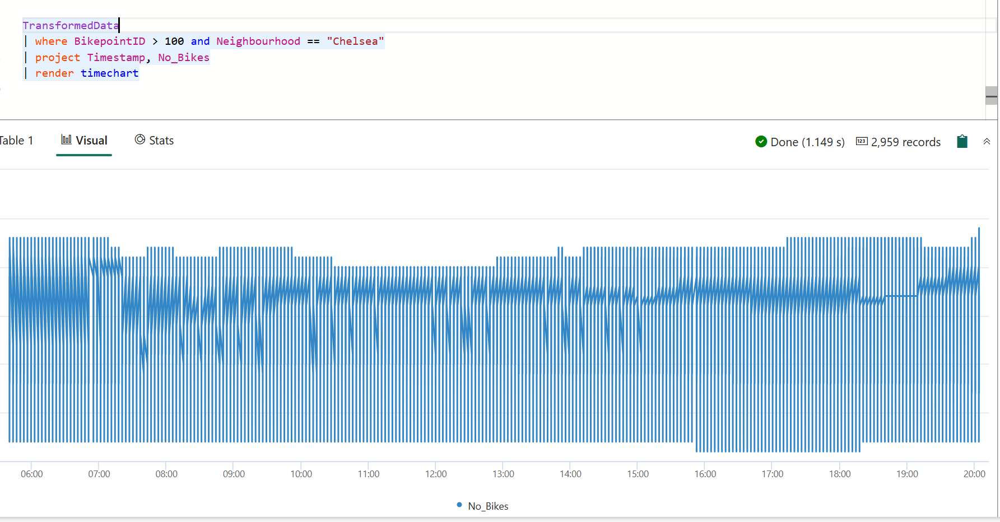

# Real-Time Intelligence tutorial part 4: Query streaming data using KQL

In this part of the tutorial, you learn how to query your streaming data in a [KQL queryset](https://learn.microsoft.com/en-us/fabric/real-time-intelligence/create-query-set). You write a KQL query and visualize the data in a time chart.

## Write a KQL query

The name of the table you created in a previous step is *TransformedData*. Use this (case-sensitive) name as the data source for your query.

1. In the query editor, delete the pre-populated queries and enter the following query. Then press **Shift + Enter** to run the query.

     ```kusto
    TransformedData | where BikepointID > 100 and Neighbourhood == "Chelsea" | project Timestamp, No_Bikes | render timechart
    ```

    This query creates a time chart that shows the number of bikes in the Chelsea neighborhood as a time chart.

    

## Create a materialized view

In this step, you create a materialized view, which returns an up-to-date result of the aggregation query (always fresh). Querying a materialized view is more performant than running the aggregation directly over the source table.

1. Copy/paste and run the following command to create a materialized view that shows the most recent number of bikes at each bike station:

    ``` kusto
    .create-or-alter materialized-view with (folder="Gold") AggregatedData on table TransformedData { TransformedData | summarize arg_max(Timestamp,No_Bikes) by BikepointID }
    ```

2. Copy/paste and run the following query to see the data in the materialized view visualized as a column chart:

    ```kusto
    AggregatedData | sort by BikepointID | render columnchart with (ycolumns=No_Bikes,xcolumn=BikepointID)
    ```

You will use this query in the next step to create a Real-Time dashboard.

> [!IMPORTANT]
> If you have missed any of the steps used to create the tables, update policy, function, or materialized views, use this script to create all required resources: [Tutorial commands script](https://github.com/microsoft/fabric-samples/blob/main/docs-samples/real-time-intelligence/tutorial-commands-script.kql).

## Next step

> Select **Next >** to create a Real-Time dashboard
