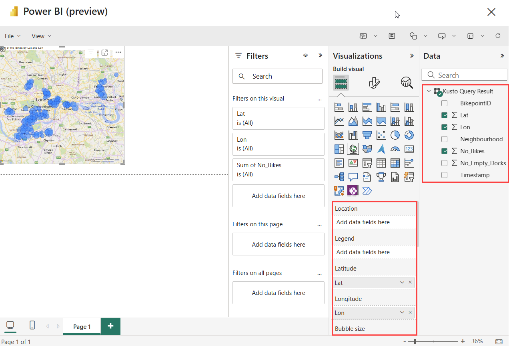
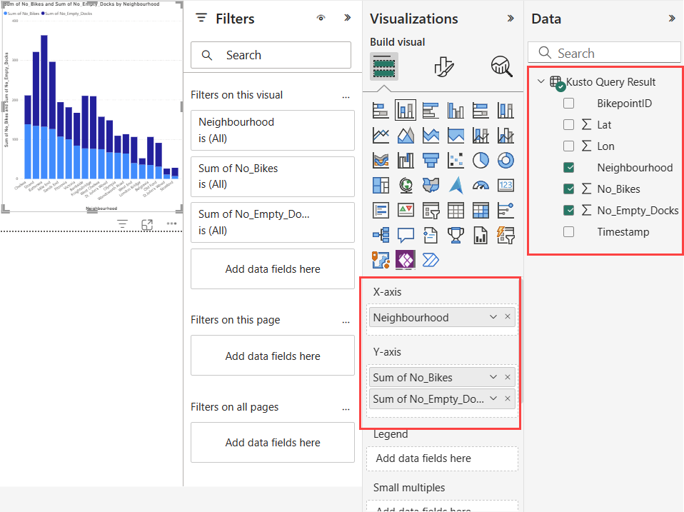

# Real-Time Intelligence tutorial part 5: Create a Power BI report

A Power BI report is a multi-perspective view into a semantic model, with visuals that represent findings and insights from that semantic model. In this section, you use a KQL query output to create a new Power BI report.

## Build a Power BI report

1. From the navigation bar open the KQL queryset you created in a previous step, named *TutorialQueryset*.
2. Copy and paste the following query into the query editor. The output of this query is used as the semantic model for building the Power BI report. 

    ```kusto
    TutorialTable | summarize arg_max(Timestamp, No_Bikes,  No_Empty_Docks, Neighbourhood, Lat=todouble(Latitude), Lon=todouble(Longitude)) by BikepointID
    ```

3. Select **Power BI**. The Power BI report editor opens with the query result available as a data source named **Kusto Query Result**.

### Add visualizations to the report

1. In the report editor, select **Visualizations** > **Map** icon.
     
2. Drag the following fields from **Data** > **Kusto Query Result** to the **Visualizations** pane.
    * **Lat** > **Latitude**
    * **Lon** > **Longitude**
    * **No_Bikes** > **Bubble size**
    * **Neighbourhood** > **Add drill-through fields here**

    

3. In the report editor, select **Visualizations** > **Stacked column chart** icon.
    
4. Drag the following fields from **Data** > **Kusto Query Result** to the **Visualizations** pane.
    * **Neighbourhood** > **X-axis**
    * **No_Bikes** > **Y-axis**
    * **No_Empty_Docks** > **Y-axis**

    

### Save the report

1. In the top left corner of the ribbon, select **File** > **Save**.
2. Enter the name +++*TutuorialReport*+++ and choose your workspace.
3. Select **Continue**.
4. Select **Open the file in Power BI to view, edit, and get a shareable link.**

## Interact with the report

When you open the Power BI report, you can add or edit visualizations. You can also interact with the visualizations. For example, selecting one of the *Neighbourhood* columns on one visualization highlights the values of that neighbourhood in the other visualizations.


Now that you have created a Power BI report, your data is visualized in a way that is easy to understand and share with others. It's time to set an alert on your event stream to receive a notification in Teams when the number of bikes falls below a certain threshold.

## Next step

> Select **Next >** to set an alert on your event stream
